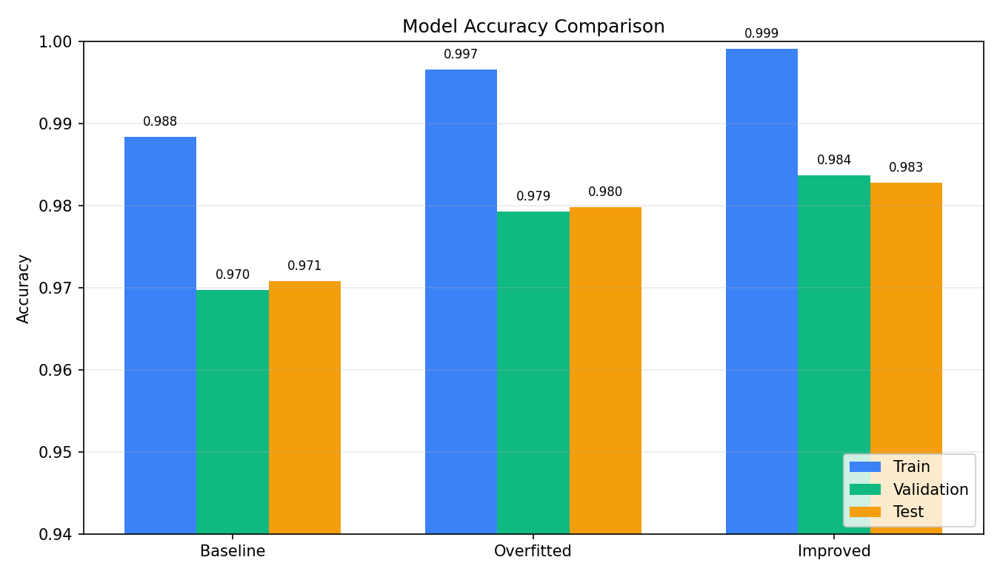
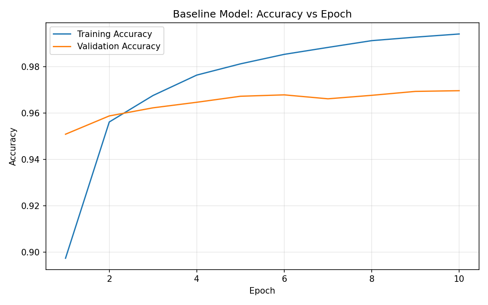
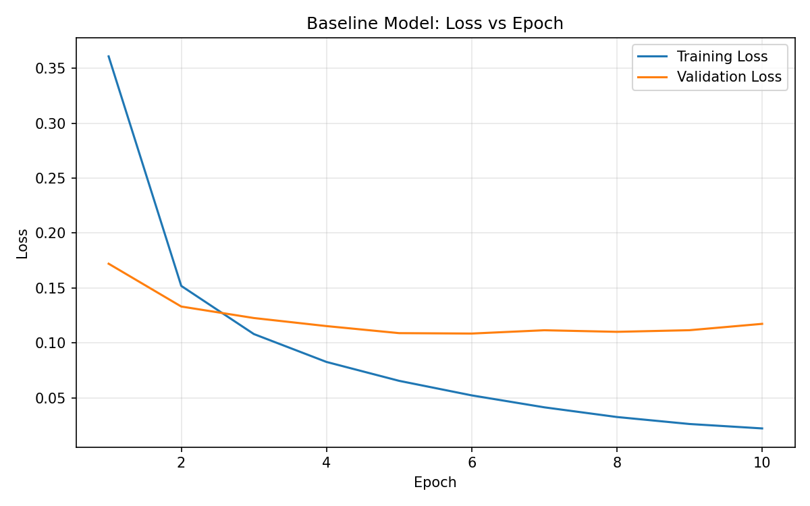
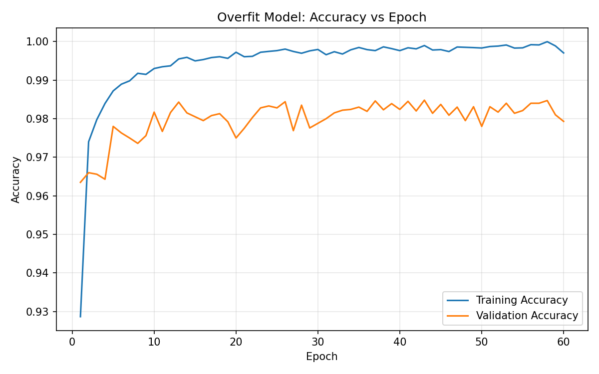
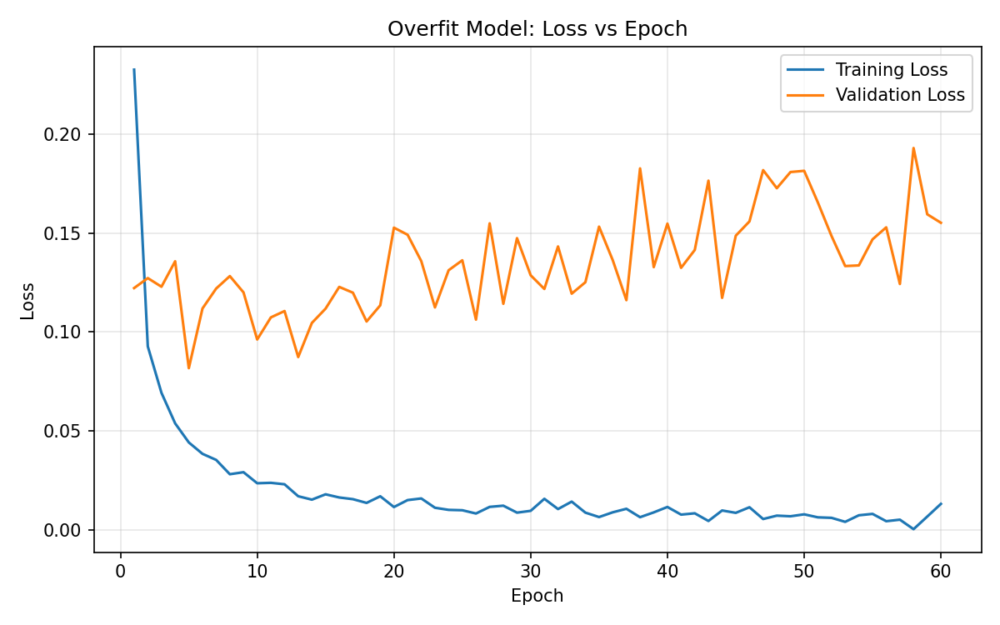
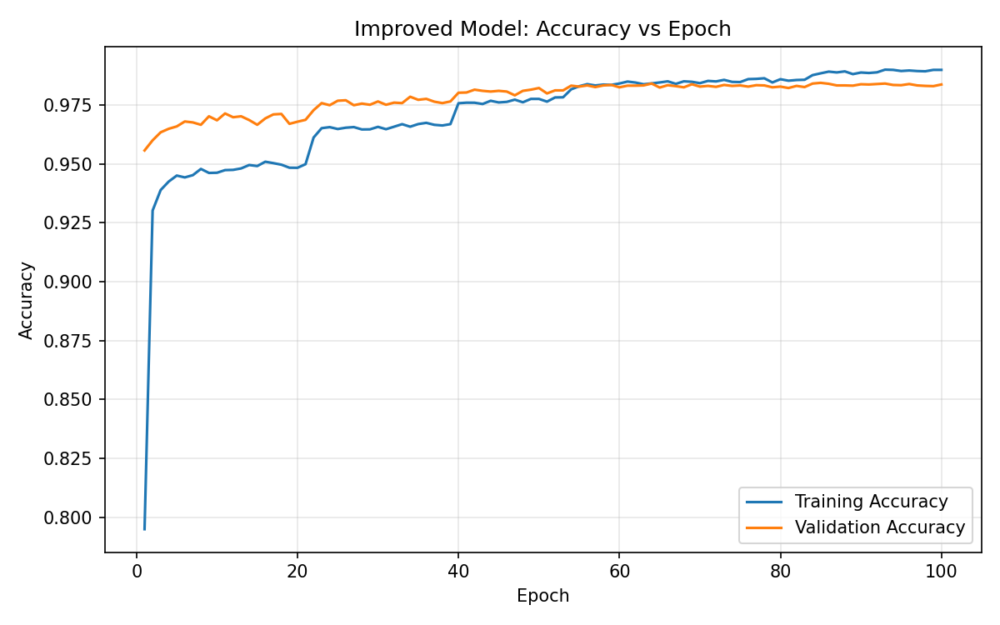
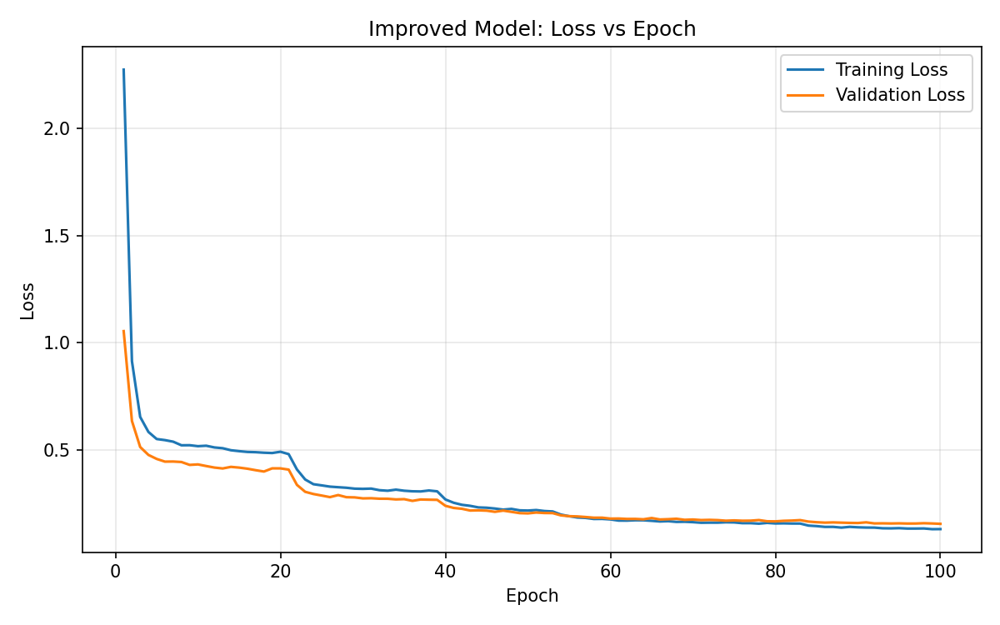
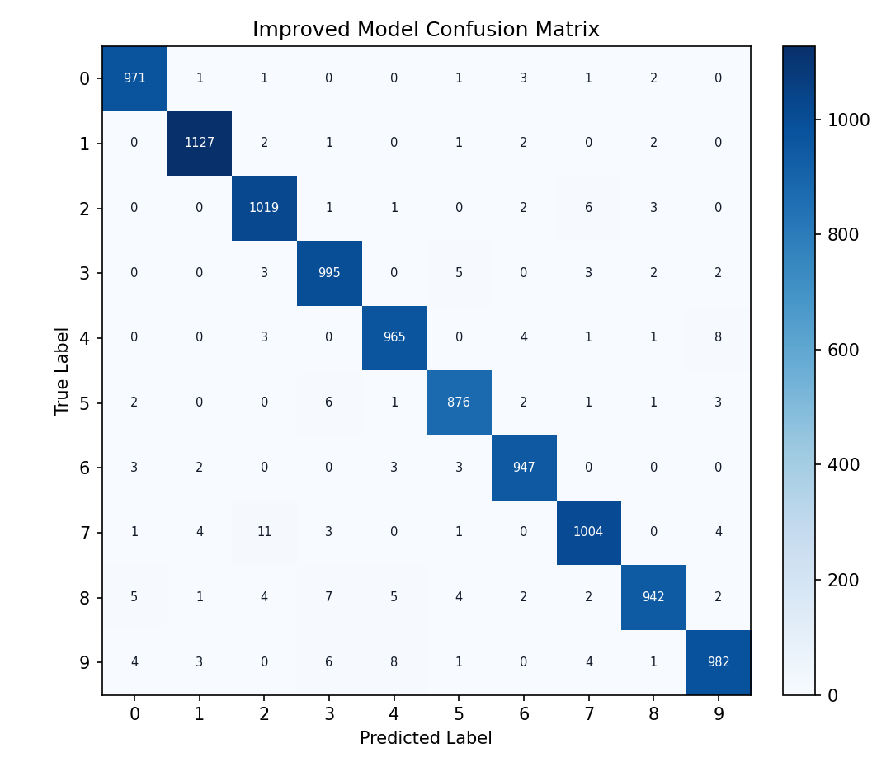
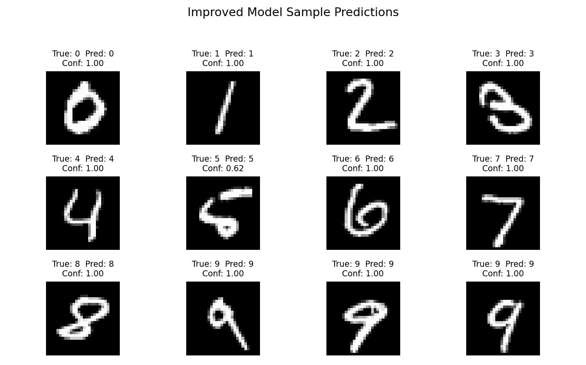

# MNIST Deep Learning Project Report

## 1. Project Overview

This project trains and compares three TensorFlow/Keras neural networks for handwritten digit classification on the MNIST dataset. The goal is to show how model capacity can cause overfitting and how regularization techniques can improve generalization while keeping the large architecture unchanged.

The main objectives of the project are:

| Objective | Explanation |
|---|---|
| Build a baseline classifier | Create a simple neural network that gives a reliable starting performance. |
| Demonstrate overfitting | Train a larger model without regularization so the difference between training and validation behavior becomes visible. |
| Reduce overfitting | Apply dropout, L2 regularization, early stopping, and learning-rate reduction to improve generalization. |
| Compare model performance | Evaluate all models on the same training, validation, and test splits for a fair comparison. |

The three models are:

| Model | Purpose |
|---|---|
| Baseline Model | A simple feed-forward neural network used as the reference model. |
| Overfitted Model | A much larger model trained without regularization to intentionally encourage overfitting. |
| Improved Model | The same large architecture as the overfitted model, improved using regularization and training callbacks. |

## 2. Dataset and Preprocessing

The project uses the standard MNIST handwritten digit dataset from `tensorflow.keras.datasets.mnist`.

| Split | Number of Images | Description |
|---|---:|---|
| Training | 50,000 | First 50,000 images from the original MNIST training set |
| Validation | 10,000 | Last 10,000 images from the original MNIST training set |
| Test | 10,000 | Official MNIST test set |

Each image is a 28 x 28 grayscale digit image. Pixel values are normalized from `[0, 255]` to `[0, 1]` before training.

Normalization is important because neural networks train more smoothly when input values are small and consistent. Without normalization, the model would receive pixel values as large as 255, which can slow training and make optimization less stable.

The validation set is separated from the training set so that model performance can be checked on data that is not used for weight updates. The test set is kept untouched until evaluation, which gives a more honest estimate of final model performance.

## 3. Project Workflow

The complete workflow followed by the project is:

| Step | Description |
|---|---|
| Load data | MNIST is loaded directly from TensorFlow/Keras. |
| Preprocess data | Pixel values are converted to `float32` and scaled to `[0, 1]`. |
| Split data | The original training set is divided into 50,000 training images and 10,000 validation images. |
| Build models | Three neural networks are created in `models.py`. |
| Compile models | Each model uses Adam optimizer, sparse categorical cross-entropy loss, and accuracy as the metric. |
| Train models | Each model is trained using the same data split but different architecture or regularization strategy. |
| Save outputs | Trained models and plots are saved for later review. |
| Evaluate models | Final train, validation, and test metrics are calculated and compared. |

## 4. Model Architectures

| Model | Architecture Summary | Parameters |
|---|---|---:|
| Baseline | Flatten -> Dense(128) -> Dense(64) -> Dense(10) | 109,386 |
| Overfitted | Flatten -> Dense(1024) -> Dense(1024) -> Dense(512) -> Dense(512) -> Dense(256) -> Dense(10) | 2,774,794 |
| Improved | Same as Overfitted, with L2 regularization and Dropout after each hidden layer | 2,774,794 |

All models use ReLU activations in hidden layers and Softmax activation in the output layer. The loss function is sparse categorical cross-entropy, and the optimizer is Adam with a learning rate of `0.001`.

The baseline model has far fewer parameters, so it is faster and less likely to memorize the training data. The overfitted and improved models have the same number of parameters, which makes the comparison fair: any improvement in the improved model comes from training strategy and regularization, not from reducing the model size.

## 5. Training Strategy

The baseline model is trained for 10 epochs. The overfitted model is trained for 60 epochs with no dropout, no L2 regularization, and no early stopping. This gives it enough capacity and training time to fit the training set very closely.

The improved model keeps the same large hidden-layer sizes as the overfitted model, but adds:

| Technique | Purpose |
|---|---|
| Dropout, rate `0.5` | Randomly disables neurons during training to reduce memorization. |
| L2 regularization, strength `0.001` | Penalizes large weights and encourages smoother decision boundaries. |
| EarlyStopping | Stops training when validation loss stops improving and restores the best weights. |
| ReduceLROnPlateau | Reduces learning rate when validation loss plateaus. |

The overfitted model is intentionally designed as a learning example. Its purpose is not only to get high accuracy, but also to show how a model can perform extremely well on training data while becoming less reliable on unseen data.

## 6. Important Implementation Details

| File | Role |
|---|---|
| `main.py` | Runs the full training and evaluation pipeline. |
| `models.py` | Defines the baseline, overfitted, and improved model architectures. |
| `train.py` | Compiles, trains, evaluates, saves models, and creates plots. |
| `utils.py` | Loads MNIST, prepares the fixed split, creates folders, plots histories, and prints comparison tables. |
| `requirements.txt` | Lists the required Python packages. |

The project also sets random seeds in `main.py` using Python, NumPy, and TensorFlow. This improves reproducibility, although exact results can still vary slightly depending on hardware and TensorFlow backend settings.

## 7. Results

The saved models were reloaded and evaluated on the fixed train, validation, and test splits.

| Model | Train Accuracy | Validation Accuracy | Test Accuracy | Train Loss | Validation Loss | Test Loss |
|---|---:|---:|---:|---:|---:|---:|
| Baseline | 98.84% | 96.97% | 97.08% | 0.0334 | 0.1174 | 0.1134 |
| Overfitted | 99.66% | 97.93% | 97.98% | 0.0158 | 0.1551 | 0.1430 |
| Improved | 99.91% | 98.37% | 98.28% | 0.1016 | 0.1570 | 0.1591 |

The improved model achieves the best validation and test accuracy. Its loss is higher because L2 regularization contributes to the reported loss value, but its accuracy shows better generalization.

## 8. Analysis of Overfitting

Overfitting can be identified by comparing training performance with validation and test performance. In this project, the overfitted model reaches 99.66% training accuracy, but its validation accuracy is 97.93% and its test accuracy is 97.98%. This gap shows that the model learned the training data more strongly than the general digit patterns.

The improved model reaches the highest test accuracy, 98.28%, while keeping the same large architecture as the overfitted model. This shows that regularization can improve performance without necessarily reducing the number of layers or neurons.

The most important comparison is between the overfitted and improved models:

| Comparison Point | Overfitted Model | Improved Model |
|---|---:|---:|
| Parameters | 2,774,794 | 2,774,794 |
| Dropout | No | Yes |
| L2 Regularization | No | Yes |
| Early Stopping | No | Yes |
| Test Accuracy | 97.98% | 98.28% |

This comparison supports the conclusion that the improvement comes from better training control and regularization rather than from using a smaller or simpler model.

## 9. Training Curves

### Baseline Model

The baseline model learns quickly and reaches good accuracy, but it has lower validation and test accuracy than the larger models.

### Overfitted Model

The overfitted model reaches very high training accuracy. Its validation loss is higher than its training loss, showing that the model fits the training data more strongly than unseen data.

### Improved Model

The improved model uses the same large architecture but adds regularization and callbacks. It produces the highest validation accuracy and the highest test accuracy among the three models.

## 10. Additional Evaluation Figures

### Confusion Matrix

The confusion matrix shows that most predictions lie on the diagonal, meaning the improved model correctly classifies most test digits. Errors mainly occur between visually similar handwritten digits.

### Sample Predictions

These examples show the improved model's predicted labels and confidence scores on selected MNIST test images.

## 11. Strengths and Limitations

### Strengths

| Strength | Explanation |
|---|---|
| Clear comparison | All models use the same dataset split, optimizer, and evaluation process. |
| Demonstrates overfitting directly | The large unregularized model shows why training accuracy alone is not enough. |
| Uses saved artifacts | Models, metrics, and plots are saved, making the experiment easier to review. |
| Improved model is fair to compare | It keeps the same architecture size as the overfitted model. |

### Limitations

| Limitation | Explanation |
|---|---|
| Dense networks only | The project does not use convolutional layers, even though CNNs are usually stronger for image classification. |
| No data augmentation | The model does not train on rotated, shifted, or transformed digit images. |
| Single dataset | The results are specific to MNIST and may not directly generalize to more complex image datasets. |
| Limited hyperparameter search | Dropout rate, L2 strength, batch size, and learning rate are not extensively tuned. |

## 12. Possible Future Improvements

The project could be extended by trying a convolutional neural network, since CNNs are designed to learn spatial patterns in images. Data augmentation could also be added to make the model more robust to small changes in handwriting style, position, and rotation.

Other useful improvements include testing different dropout rates, trying different L2 strengths, adding batch normalization, and saving a classification report with precision, recall, and F1-score for each digit class.

## 13. Conclusion

The experiment shows that increasing model capacity can improve performance, but it also increases the risk of overfitting. The overfitted model performs better than the baseline, but its training accuracy is much higher than its validation and test accuracy.

The improved model is the best final model because it keeps the large architecture while using dropout, L2 regularization, early stopping, and adaptive learning-rate reduction. It achieves the highest test accuracy at 98.28%, making it the strongest generalizing model in this project.

Overall, the project successfully demonstrates the full deep learning workflow: dataset preparation, model design, training, overfitting analysis, regularization, evaluation, visualization, and final comparison.

## 14. Generated Outputs

| Output | Location |
|---|---|
| Baseline saved model | `saved_models/baseline_model.keras` |
| Overfitted saved model | `saved_models/overfit_model.keras` |
| Improved saved model | `saved_models/improved_model.keras` |
| Baseline training plots | `plots/baseline_model_accuracy.png`, `plots/baseline_model_loss.png` |
| Overfitted training plots | `plots/overfit_model_accuracy.png`, `plots/overfit_model_loss.png` |
| Improved training plots | `plots/improved_model_accuracy.png`, `plots/improved_model_loss.png` |
| Accuracy comparison figure | `plots/model_accuracy_comparison.png` |
| Confusion matrix figure | `plots/improved_model_confusion_matrix.png` |
| Sample prediction figure | `plots/improved_model_sample_predictions.png` |
| Report metrics | `report_metrics.json` |
